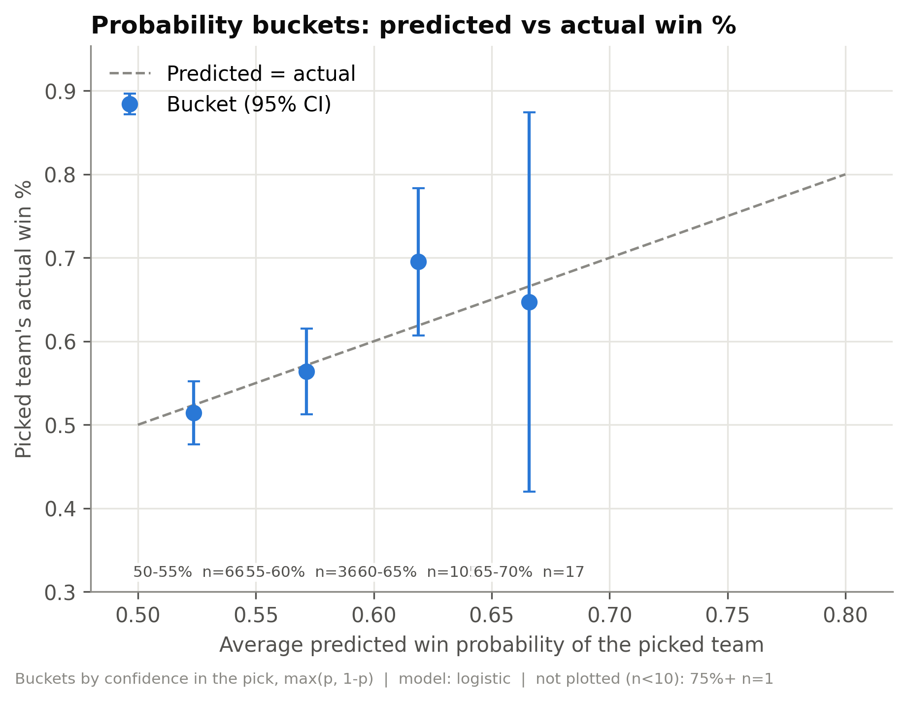
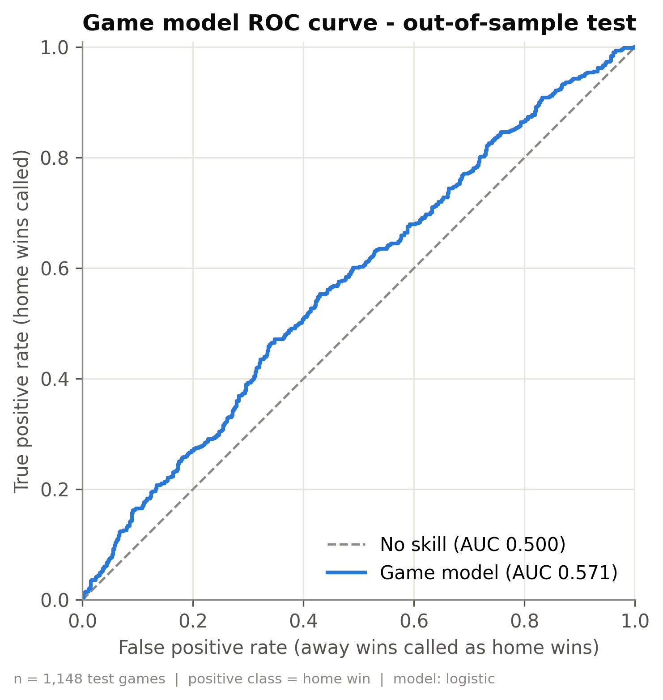
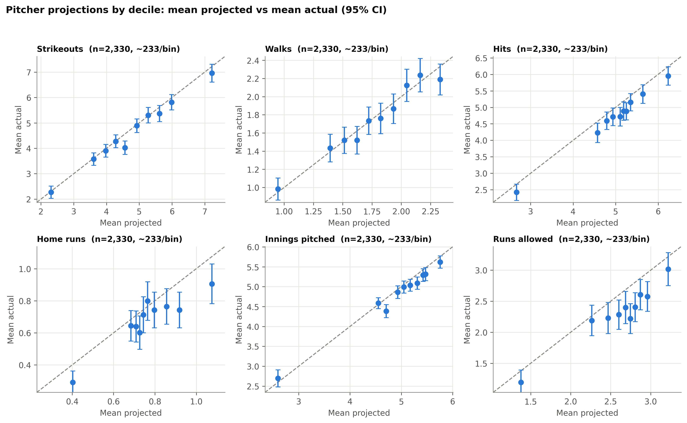
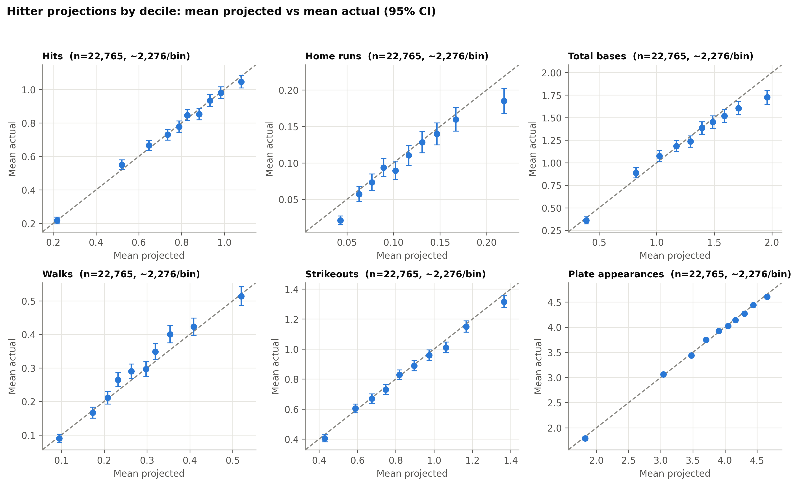
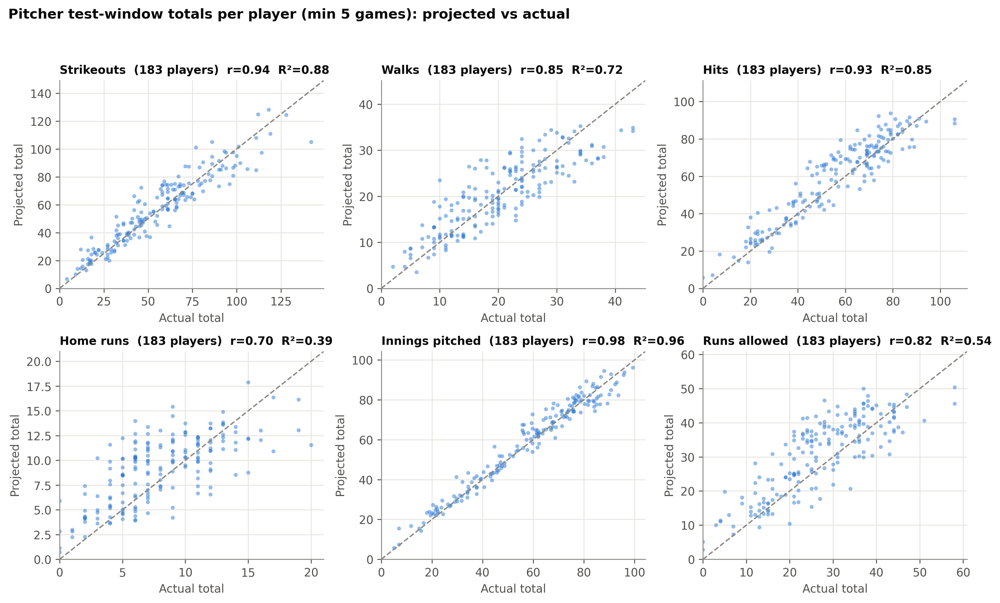
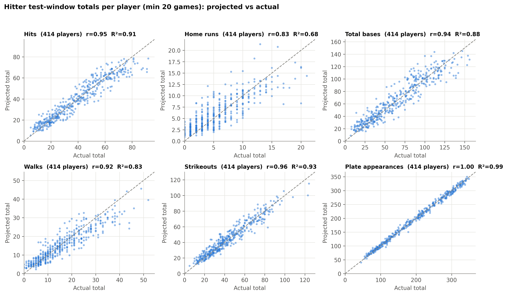

# InTheCount: MLB Game and Player Projection System

*Technical report*

## 1. Executive Summary and Key Findings

InTheCount is a public MLB projection system. Each day it publishes a win probability for every game and projections for each starting pitcher (innings, strikeouts, walks, hits, home runs, runs allowed) and each lineup hitter (plate appearances, hits, total bases, strikeouts, walks, home runs), then grades every number against the box score. It is built on three seasons of pitch-level Statcast data. All results below are out-of-sample: models were chosen on the first part of the latest season and scored once on its remainder.

### Summary of Out-of-Sample Performance

Each percentage is how much smaller the projection's typical single-game miss is than the miss of a simple benchmark. The miss is measured as RMSE (root-mean-square error) on the test games. *League average* gives every player the league's average for that stat. *Player's own history* gives every player his own average over all his earlier games in the history window. The 95% interval is in parentheses.

| Projection | vs league average | vs player's own history |
|:---|---:|---:|
| Hitter plate appearances | +30.6% (+29.5 to +31.9) | +24.6% (+23.6 to +25.6) |
| Pitcher innings pitched | +19.1% (+16.6 to +21.5) | +16.2% (+13.6 to +18.5) |
| Pitcher strikeouts | +13.6% (+12.0 to +15.2) | +8.3% (+6.7 to +9.9) |

For example, the projection's typical miss on a hitter's plate appearances is 0.775 PA. Predicting the league average gives 1.116, and the player's own average gives 1.027. Those differences are the +30.6% and +24.6% in the first row. A positive number means the projection is better.

All 12 player projections beat the league average with an interval above zero, and 12 of 12 beat the player's own history-to-date average. The gains are largest where playing time drives the outcome and small for rare events: against the player's own history, hitter home runs, hitter walks and pitcher home runs improve by less than 2%.

### Game-Level Predictive Performance

On the test games the selected game model's log loss is 0.6827, against 0.6911 for always picking the home team, and its accuracy is 54.9% against 53.2%. Its test AUC is 0.571. The logistic regression and optimized stack improve on the home-team baseline with 95% intervals that exclude zero on the test games. Section 4 gives the full comparison.

### Evaluation Integrity and Leakage Prevention

The rebuild found and removed same-game information that had leaked into the hitter features, along with test-set model selection. Automated tests now rebuild the feature tables after changing one game's outcome and require that none of that game's features move, and require that seasons outside the history window cannot change any feature. The full suite passes (30 passed).

## 2. Data, Feature Engineering, and Leakage Prevention

All modelling data is pitch-level Statcast. Every season is validated before use: record and game counts, date range, required columns, missing IDs, duplicate pitches, one date and home/away pair per game, and 30 teams.

| Season | Pitches | Reg.-season games | Pitchers | Batters | Validation |
|:---|---:|---:|---:|---:|:---|
| 2024 | 760,249 | 2,429 | 855 | 651 | Pass |
| 2025 | 770,795 | 2,430 | 873 | 673 | Pass |
| 2026 | 759,545 | 2,429 | 868 | 662 | Pass |

### Historical Data Window and Feature Construction

A projection for a game in season *S* may use the player's games from seasons *S−2* and *S−1* and from season *S* strictly before the game. The window is applied to the raw pitches before any feature is built, so older data cannot reach a feature indirectly. Inside the window, every feature is a trailing summary of earlier games: rolling averages over the previous 7 to 30 appearances, a history-to-date average, handedness splits, true-talent rates shrunk toward a league prior, a pitcher-vs-lineup matchup rate, opponent context and, for hitters, the posted batting-order slot. Spring-training games are excluded.

### Feature Architecture and Input Variables

Number of model inputs in each feature group:

| Feature group | Pitcher | Hitter | What it contains |
|:---|---:|---:|:---|
| Rolling windows | 45 | 47 | Strikeouts, hits, walks and rates over the last 7-30 games |
| History-to-date | 9 | 9 | Same statistics averaged over all earlier games in the window |
| Playing time / workload | 38 | 8 | Innings, batters faced, pitch counts, days of rest; plate appearances |
| Handedness splits | 16 | 16 | Rates against left- and right-handed opponents |
| Opponent context | 8 | 23 | Opponent's recent rates against this handedness; opposing starter's form |
| True talent | 4 | 4 | Rates shrunk toward the league according to sample size |
| Matchup | 8 | 0 | Pitcher-vs-lineup rate combining both true-talent estimates |
| Batted-ball quality | 0 | 22 | Exit velocity, launch angle, hard-hit and barrel proxies |
| Stuff | 4 | 0 | Velocity and spin |
| Lineup slot | 0 | 2 | Today's posted batting-order slot and the recent average slot |
| Park | 1 | 1 | Park factor |

Three seasons are collected. The earliest one serves as history only, because its own rows have no prior seasons inside their window and would teach the model from thinner features than it sees in use.

### Changes to the Modeling Pipeline

The original feature definitions were kept and given two extra seasons of history. The data-leakage and protocol bugs listed below were fixed. One feature was added (lineup slot) and a linear model and stacked models were added as candidates. No other feature definition changed.

### Leakage Corrections and Automated Safeguards

The cutoff for every feature is the first pitch of the game being predicted. The five most consequential fixes:

| Problem | Fix |
|:---|:---|
| Opposing starter's same-game results in hitter features | Use his previous start (known pre-game) |
| Model family chosen on the test set | Choose on a validation window; score the test once |
| Validation and calibration trained on later games | Forward-in-time splits only |
| Starter = last pitcher in file order (often a reliever) | Pitcher of the team's first pitch |
| Public ledger scored past games with models trained on them | In-sample projections excluded |

**Safeguards:** (1) a perturbation test turns every plate appearance of one game into a home run, rebuilds all tables and requires that none of that game's features change (run against the old code, it flags exactly the leaked opposing-starter columns); (2) an older-season test confirms that data outside the window cannot change any feature; (3) a train/serve parity test confirms that features built for a scheduled slate equal the stored training rows; (4) a static guard rejects any feature that is not a trailing summary or an explicitly justified pre-game fact; (5) 38 of 38 automated data and protocol checks pass before any metric is computed.

## 3. Modeling Methodology and Evaluation

### Player Projection Model Architecture

For every target, three model families are fit: a random forest, a Poisson-loss XGBoost and a Poisson regression. Two stacks of these (equal weights, and weights optimized on validation and scored out-of-fold) compete with them. The candidate with the lowest validation RMSE is refit on all data before the test window. Each count also has a per-opportunity model (per nine innings or per plate appearance). The published number blends the direct count with rate × predicted innings or plate appearances, using fixed weights. A neural network was tried and dropped: it was the weakest family on validation and the slowest to train.

### Game-Level Win Probability Model

The candidates are an isotonic-calibrated XGBoost, a random forest with and without isotonic calibration, a strongly regularized logistic regression, and two stacks of these. An uncalibrated XGBoost was dropped because it fit the training games far better than new ones. Each of the 18 features is a home-minus-away difference:

| Group | Features |
|:---|:---|
| Offense, last 10 games | Runs scored, OPS, strikeout rate, walk rate |
| Run prevention, last 10 games | Runs allowed |
| Starting pitcher | FIP, K-BB%, HR/9 over his last 10 starts; FIP and K-BB% season to date |
| Bullpen, last 14 games | ERA proxy, WHIP, K-BB% |
| Team strength, season to date | Win %, run differential, OPS |
| Context | Home field; starter handedness match-up |

The model is selected on validation log loss, because the site publishes probabilities and log loss rewards probabilities that are both well ranked and honest. AUC only measures ranking.

### Model Configuration and Regularization

These defaults are deliberately shallow and regularized, because a single start or game is mostly noise and deep trees memorize hot and cold streaks. XGBoost depth, learning rate and regularization are tuned per target on the training rows only.

| Model | Settings |
|:---|:---|
| Random forest | 400 trees, depth 4 (5 for plate appearances), at least 25 rows per leaf, half the features per split |
| XGBoost (players) | Poisson loss for counts; about 400 trees, depth 3, learning rate 0.03, L1 1.0 / L2 3.0 |
| Poisson regression | Standardized inputs, L2 penalty 0.05 |
| Game XGBoost | 600 trees, depth 4, learning rate 0.03, L1 0.5 / L2 2.0 |
| Game random forest | 600 trees, depth 6, at least 20 games per leaf |
| Game logistic regression | Standardized inputs, strong L2 penalty (C = 0.001) |

### Model Selection and Validation Results

The candidate chosen on validation for each published count:

| Projection | Chosen on validation | Stack weights | Validation RMSE |
|:---|:---|:---|---:|
| Pitcher innings pitched | XGBoost | - | 1.185 |
| Pitcher strikeouts | Optimized stack | RF 0.06, XGB 0.57, Poisson 0.37 | 2.190 |
| Pitcher hits | Optimized stack | RF 0.00, XGB 0.77, Poisson 0.23 | 2.152 |
| Pitcher walks | Even stack | RF 0.33, XGB 0.33, Poisson 0.33 | 1.290 |
| Pitcher home runs | Optimized stack | RF 0.25, XGB 0.62, Poisson 0.13 | 0.857 |
| Pitcher runs allowed | Random forest | - | 1.947 |
| Hitter plate appearances | XGBoost | - | 0.785 |
| Hitter hits | Optimized stack | RF 0.13, XGB 0.87, Poisson 0.00 | 0.787 |
| Hitter total bases | XGBoost | - | 1.583 |
| Hitter strikeouts | Optimized stack | RF 0.00, XGB 0.96, Poisson 0.04 | 0.824 |
| Hitter walks | Optimized stack | RF 0.11, XGB 0.80, Poisson 0.09 | 0.541 |
| Hitter home runs | Optimized stack | RF 0.00, XGB 0.62, Poisson 0.38 | 0.322 |

### Direct-Count and Rate-Based Projection Blending

The published number is (1 − w) × direct count + w × (rate × predicted innings or plate appearances). Innings and plate appearances are themselves predicted directly. The weights w are fixed:

| Projection | Weight on rate model |
|:---|---:|
| Pitcher strikeouts | 0.50 |
| Pitcher walks | 0.25 |
| Pitcher hits | 0.20 |
| Pitcher home runs | 0.30 |
| Pitcher runs allowed | 0.30 |
| Hitter hits | 0.55 |
| Hitter home runs | 0.50 |
| Hitter walks | 0.50 |
| Hitter strikeouts | 0.50 |
| Hitter total bases | 0.55 |

### Temporal Validation and Evaluation Protocol

Models train on earlier games, are chosen on a validation window that follows the training data, and are scored once on a later test window. Player models train on the 2025 season (2024 supplies history only) and the game model on the 2024 and 2025 seasons. Validation is the 2026 season through June, and the test window is July through the end of the 2026 regular season. Every choice of model, stack weight and calibration is made on validation; the test window is scored once. The published models are then refit through June 2026, so their projections for earlier 2026 games are in-sample and are excluded from the public accuracy ledger (Section 6). Baselines are the league average, the player's history-to-date average and his last-10 average for players, and always-home for games. Intervals throughout are 95% bootstrap intervals that resample whole game dates, because players on the same day share weather, umpires and opponents.

### Evaluation Metrics and Interpretation

| Measure | Meaning |
|:---|:---|
| RMSE | Typical size of a single-game miss, in the stat's own units; large misses count more |
| % vs baseline | How much smaller the projection's RMSE is than the baseline's (positive = better) |
| Bias | Average of projected minus actual; positive = projections run high |
| Log loss | Penalty on the probability given to what happened; lower is better, 0.693 = coin flip |
| Brier score | Mean squared error of a probability; 0.25 = always saying 50% |
| AUC | Chance a random home win is rated above a random home loss; 0.5 = no ranking skill |
| Calibration | Whether games given 60% are won about 60% of the time |

## 4. Game-Level Win Probability Model Evaluation

1,148 regular-season test games; the home team won 53.2% of them.

| Model | Valid log loss | Test log loss | Test Brier | Test AUC | Test accuracy |
|:---|---:|---:|---:|---:|---:|
| Logistic regression (selected) | 0.6893 | 0.6827 | 0.2448 | 0.571 | 54.9% |
| Optimized stack | 0.6905 | 0.6828 | 0.2449 | 0.569 | 55.1% |
| Always home (base rate) | n/a | 0.6911 | 0.2490 | n/a | 53.2% |

**Against always-home** (log loss minus the always-home log loss, ×1000; negative is better):

| Model | Validation | Test |
|:---|---:|---:|
| Logistic regression | -2.6 (-8.2 to +2.6) | -8.4 (-14.1 to -2.4) |
| Optimized stack | -1.5 (-7.5 to +4.2) | -8.2 (-13.9 to -2.2) |

On the test games, the logistic regression and the optimized stack improve on the home-team baseline with intervals that exclude zero. On the shorter validation window, all three intervals include zero.

**Deployment decision: keep the deployed model.** On validation the selected model's log loss (0.6893) was 0.0029 lower than the deployed model's live picks (0.6922). That passes the automatic promotion gate, but the difference is small relative to its uncertainty. On the 738 test games both covered, the deployed model was slightly better (0.6898 vs 0.6886). The deployed model stays in production.

### Probability Calibration and Reliability

The selected model's average level is right: calibration-in-the-large is -0.026 on validation and +0.003 on test, where zero is perfect. Expected calibration error is 0.015 and 0.015. The calibration slope is 0.82 on validation and 1.23 on test, where 1 is ideal; below 1, the probabilities spread further from 50% than the outcomes justify.
 The 75%+ bucket holds only 1 test games. The favorite won 100% against a mean prediction of 76%, but the 95% interval for that rate runs from 21% to 100%, so over-confidence there cannot be established.

<figure><figcaption>Figure 1. Predicted vs. Observed Win Rate by Probability Bucket</figcaption></figure>

### Discrimination Performance: ROC Curve and AUC

The ROC curve shows how well the probabilities order games, at every possible cut-off. AUC is the area under it, from 0.5 for no ranking skill to 1.0 for perfect ranking. The selected model's test AUC is 0.571, against 0.541 on validation, above the 0.5 line of a model with no ranking ability.

<figure><figcaption>Figure 2. ROC Curve for Game-Level Win Predictions</figcaption></figure>

## 5. Player-Level Projection Model Evaluation

The primary measure is the reduction in single-game RMSE versus each baseline, with its interval. Bias is the mean of projected minus actual (positive = over-projection).

**Starting pitchers** (2,330 test pitcher-games):

| Target | Actual mean | Bias | RMSE | vs league | vs own history | vs last 10 |
|:---|---:|---:|---:|---:|---:|---:|
| Innings pitched | 4.79 | +0.111 (+2%) | 1.203 | +19.1% (+16.6 to +21.5) | +16.2% (+13.6 to +18.5) | +7.7% (+6.1 to +9.4) |
| Strikeouts | 4.64 | +0.141 (+3%) | 2.180 | +13.6% (+12.0 to +15.2) | +8.3% (+6.7 to +9.9) | +5.1% (+3.7 to +6.4) |
| Hits | 4.70 | +0.280 (+6%) | 2.111 | +8.0% (+6.7 to +9.5) | +7.2% (+5.4 to +8.8) | +5.3% (+3.8 to +6.6) |
| Walks | 1.74 | +0.013 (+1%) | 1.237 | +4.1% (+3.0 to +5.3) | +3.6% (+2.5 to +4.5) | +4.5% (+3.1 to +6.0) |
| Home runs | 0.68 | +0.084 (+12%) | 0.833 | +1.1% (+0.3 to +1.9) | +1.5% (+0.5 to +2.5) | +4.7% (+3.4 to +5.8) |
| Runs allowed | 2.31 | +0.289 (+13%) | 1.898 | +2.0% (+1.0 to +3.0) | +2.6% (+1.2 to +3.8) | +4.0% (+2.8 to +5.2) |

**Hitters** (22,765 test hitter-games):

| Target | Actual mean | Bias | RMSE | vs league | vs own history | vs last 10 |
|:---|---:|---:|---:|---:|---:|---:|
| Plate appearances | 3.74 | +0.012 (+0%) | 0.775 | +30.6% (+29.5 to +31.9) | +24.6% (+23.6 to +25.6) | +23.5% (+22.7 to +24.3) |
| Hits | 0.76 | +0.001 (+0%) | 0.784 | +4.2% (+3.8 to +4.5) | +3.4% (+3.1 to +3.7) | +7.1% (+6.7 to +7.6) |
| Total bases | 1.24 | +0.040 (+3%) | 1.577 | +2.8% (+2.4 to +3.1) | +2.6% (+2.2 to +3.0) | +6.5% (+5.9 to +7.1) |
| Strikeouts | 0.86 | +0.017 (+2%) | 0.813 | +4.7% (+4.3 to +5.1) | +2.1% (+1.9 to +2.4) | +6.0% (+5.6 to +6.3) |
| Walks | 0.30 | -0.013 (-4%) | 0.531 | +2.5% (+2.2 to +2.8) | +1.4% (+1.2 to +1.7) | +5.6% (+5.2 to +6.1) |
| Home runs | 0.11 | +0.010 (+9%) | 0.322 | +0.9% (+0.7 to +1.2) | +1.2% (+0.8 to +1.7) | +5.4% (+4.9 to +6.1) |

On mean absolute error (MAE) the projections beat every simple baseline except for home runs (pitcher), runs allowed (pitcher) and home runs (hitter). MAE rewards predicting the median, which is zero for rare events, so it is not used as the primary measure for a projected mean.

### Projection Calibration by Predicted Value

Single games are mostly noise. A hitter projected for 1.1 hits gets 0, 1, 2 or 3. The decile view sorts test games into ten equal groups by projection and compares the mean projection with the mean result.

<figure><figcaption>Figure 3. Pitcher Projection Calibration by Decile</figcaption></figure>

<figure><figcaption>Figure 4. Hitter Projection Calibration by Decile</figcaption></figure>

### Aggregated Player-Level Performance

Each player's projections and results were summed over the test window, for players with at least the minimum number of games. R² here is the share of player-to-player variation in those totals that the projections explain.

| Projection | Players | Min. games | Correlation | R² | Total bias |
|:---|---:|---:|---:|---:|---:|
| Pitcher strikeouts | 183 | 5 | 0.94 | 0.88 | +1.31 |
| Pitcher walks | 183 | 5 | 0.85 | 0.72 | +0.14 |
| Pitcher hits | 183 | 5 | 0.93 | 0.85 | +3.40 |
| Pitcher home runs | 183 | 5 | 0.70 | 0.39 | +1.11 |
| Pitcher innings pitched | 183 | 5 | 0.98 | 0.96 | +1.08 |
| Pitcher runs allowed | 183 | 5 | 0.82 | 0.54 | +3.69 |
| Hitter hits | 414 | 20 | 0.95 | 0.91 | -0.13 |
| Hitter home runs | 414 | 20 | 0.83 | 0.68 | +0.41 |
| Hitter total bases | 414 | 20 | 0.94 | 0.88 | +1.65 |
| Hitter walks | 414 | 20 | 0.92 | 0.83 | -0.74 |
| Hitter strikeouts | 414 | 20 | 0.96 | 0.93 | +0.96 |
| Hitter plate appearances | 414 | 20 | 1.00 | 0.99 | +0.30 |

<figure><figcaption>Figure 5. Predicted vs. Actual Pitcher Totals</figcaption></figure>

<figure><figcaption>Figure 6. Predicted vs. Actual Hitter Totals</figcaption></figure>

### Test-Set Comparison of Model Families

Test RMSE, lower is better. Single families and the stack are fit on the training window only; the published model is refit through validation.

*Starting pitchers*

| Target | Published | RF | XGB | Poisson | Opt. stack | History avg | League avg |
|:---|---:|---:|---:|---:|---:|---:|---:|
| Innings pitched | 1.203 | 1.219 | 1.219 | 1.231 | 1.212 | 1.435 | 1.487 |
| Strikeouts | 2.180 | 2.236 | 2.223 | 2.227 | 2.202 | 2.379 | 2.524 |
| Hits | 2.111 | 2.159 | 2.137 | 2.151 | 2.133 | 2.275 | 2.296 |
| Walks | 1.237 | 1.262 | 1.264 | 1.267 | 1.258 | 1.283 | 1.290 |
| Home runs | 0.833 | 0.833 | 0.830 | 0.839 | 0.830 | 0.846 | 0.843 |
| Runs allowed | 1.898 | 1.892 | 1.896 | 1.915 | 1.891 | 1.949 | 1.936 |

*Hitters*

| Target | Published | RF | XGB | Poisson | Opt. stack | History avg | League avg |
|:---|---:|---:|---:|---:|---:|---:|---:|
| Plate appearances | 0.775 | 0.825 | 0.778 | 0.972 | 0.778 | 1.027 | 1.116 |
| Hits | 0.784 | 0.791 | 0.786 | 0.802 | 0.786 | 0.811 | 0.818 |
| Total bases | 1.577 | 1.584 | 1.578 | 1.599 | 1.578 | 1.619 | 1.622 |
| Strikeouts | 0.813 | 0.825 | 0.816 | 0.821 | 0.816 | 0.830 | 0.852 |
| Walks | 0.531 | 0.534 | 0.533 | 0.535 | 0.533 | 0.539 | 0.545 |
| Home runs | 0.322 | 0.323 | 0.322 | 0.323 | 0.322 | 0.326 | 0.325 |

### Ablation Study: Impact of Batting-Order Features

Hitter models gained the batting-order slot the hitter starts in (posted before first pitch) and his average slot over the previous ten games. Everything else was held fixed: data, protocol, model families and test games. The table shows the change in test RMSE from adding the two features; negative means better.

| Projection | Random forest | XGBoost |
|:---|---:|---:|
| Plate appearances | -10.6% | -14.2% |
| Hits | -0.7% | -1.0% |
| Total bases | -0.7% | -0.8% |
| Strikeouts | -0.2% | -0.4% |
| Walks | -0.2% | -0.3% |
| Home runs | +0.0% | -0.1% |

The slot matters mostly through playing time, because a hitter's place in the order sets how often he comes up.

### Comparison with the Original Pipeline

On the same test games, the rebuilt pitcher projections are within 0.6% of the original on RMSE for every target. The hitter projections improve on plate appearances (-12.1%) and are worse on walks (+2.9%), hits (+2.5%), home runs (+3.6%), strikeouts (+2.3%) and total bases (+2.8%). The original hitter features contained the opposing starter's same-game results, which are not available before first pitch, so its numbers on those targets are optimistic rather than achievable live. How much of each gap comes from the leak was not measured separately.

## 6. Website Deployment and Public Accuracy Ledger

### Site Architecture and Daily Update Schedule

The public site is a lightweight web service that reads the files the pipeline commits; it does no modelling itself. A scheduled job runs the full pipeline several times a day: overnight to grade the previous day and post the first slate, late morning for day-game lineups, and late afternoon once most night-game lineups are posted. Each run commits its outputs and the service redeploys from them. The same code path that builds the training tables builds each day's inputs, so a projection is computed exactly as the evaluation scored it:

1. The current season's pitches are refreshed, with a short overlap so late-arriving data is picked up.
2. Feature tables are rebuilt on the history window from data before today only.
3. Probable starters and posted lineups are read from the MLB Stats API. A hitter's batting-order slot is used only once the lineup is posted.
4. The player models and the game model score the slate. Evening runs also publish the next day's games, so the site is never a day behind.
5. Finished games are graded against the box score. Grading results are never used for training.

### Published Outputs

| Page | Content |
|:---|:---|
| Games | Home and away win probability and predicted winner for every game, with both starters |
| Pitchers | Projected innings, strikeouts, hits, walks, home runs and runs allowed for each starter |
| Hitters | Projected plate appearances, hits, total bases, strikeouts, walks and home runs for each lineup hitter |
| Accuracy | Season record of game picks and running accuracy; graded player projections by stat |
| Player detail | Recent game logs and splits by opposing handedness |
| Rankings | Season player value rankings |

### Public Accuracy Ledger and Season Re-run

Every published number is graded against the box score and kept in a public ledger. Each row records the model that produced it and when that model's training data ended, and any projection for a game the model was trained on is excluded from the accuracy shown. Because the deployed models are refit through June, the season was re-run for the ledger with pre-season models: the same pipeline trained only on games before 2026 and frozen for the whole season, as they could have been built on opening day. Every graded game from opening day on is therefore out-of-sample. Days after the re-run are added by the deployed models as they are published.

Game picks in the public ledger:

| Source | Games | Accuracy | Log loss | Home team won |
|:---|---:|---:|---:|---:|
| Pre-season model (frozen) | 2,454 | 54.3% | 0.6862 | 52.8% |

## 7. Conclusions

InTheCount turns pitch-level Statcast data into daily projections for every starting pitcher and lineup hitter, and a win probability for every game. All of it was evaluated the way it is used: models chosen on one stretch of games and scored once on a later stretch they had never seen. On that test, all 12 player projections beat both the league average and the player's own history, with intervals above zero. The gains are largest where playing time drives the result: hitter plate appearances +30.6% against the league average, pitcher innings pitched +19.1% against the league average and pitcher strikeouts +13.6% against the league average. Knowing who starts, where a hitter bats and how deep a starter usually goes is the information a simple average cannot carry.

For rare events the honest answer is a small edge. Pitcher home runs, hitter walks and hitter home runs improve on the player's own average by less than 2%. A single game's home runs or walks are close to the limit of what any pre-game information can predict. Summed over a full window the projections still rank players well, so they are most useful for weekly and season-level decisions rather than single games.

The pitcher projections run high for runs allowed (+13%), home runs (+12%) and hits (+6%). Most of that comes from the rate-times-innings part of the published blend, which points to how the blend is weighted rather than to the underlying models.

The game model's probabilities are well calibrated on average (calibration-in-the-large +0.003 on test). Its test log loss of 0.6827 and accuracy of 54.9% compare with 0.6911 and 53.2% for always picking the home team.

